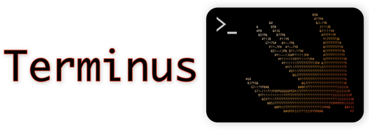

   
    



# What is it?
The goal of Terminus is to make writing visually appealing command line applications fast, efficient, and intuitive.  It aims to provide both high level building blocks like menus and user prompts (y/n, multiple choice, REPL, etc.) as well as lower level access to ANSI codes for users that one more complete control.

* Please note: Terminus is an early stage project.  I am actively seeking feedback and additional contributers, so get in touch if this is something that interests you!

# Usage/Examples

The `Terminal` class is a shared singleton that provides the primary interface for outputting text, moving the cursor, and interacting with the terminal.  When first instantiated, the input mode is set to .cbreak and echoing is turned off.
```swift
import Terminus
let terminal = Terminal.shared
```
## Printing output
To print to the screen use one of the `terminal`'s write methods:
* ``Terminal/write(_:attributes:)``
* ``Terminal/write(attributedString:)``.

```swift
terminal.write("Hello world!")
```
## Text Attributes
Most modern terminal emulators support text styling and color (256 is typical).  To add one or more styles to text you can pass an array of attributes when calling write.  See ``Attribute`` for the list of text styles and color support.
```swift
terminal.write("I am bold and underlined.\n", attributes: [.bold, .underline])
```
You can also use attributed strings to add styling as in:
```swift
var attributedString = AttributedString("Hello, bold, underlined, world.")
if let boldRange = attributedString.range(of: "bold") {
    attributedString[boldRange].terminalTextAttributes = [.bold]
}
if let underlinedRange = attributedString.range(of: "underlined") {
    attributedString[underlinedRange].terminalTextAttributes = [.underline]
}
terminal.write(attributedString: attributedString)
```
## Colors
Terminal cells have a foreground color (typically white) and background color (typically black).  Colors can be explicitly defined using RGB or selected by name from built-in color palettes.

You can specify the foreground color using ``Attribute/color(_:)`` and any ``Color`` specified in RGB.
```swift
let greenColor = Color(r:0, g:255, b:0)
terminal.write("Grass is green.\n", attributes: [.color(greenColor)])
```
To set both the foreground and background colors use ``Attribute/colorPair(_:)`` passing in a ``ColorPair``.
```swift
let redColor = Color(r: 255, g:0, b:0)
let grayColor = Color(r: 200, g:200, b:200)
let redOnGray = ColorPair(foreground: redColor, background: grayColor)
terminal.write("Red rum.\n", attributes: [.colorPair(redOnGray)])
```

Terminus also has built-in color palettes that can be used to specify colors by name.  Colors from palettes are passed around just like any other ``Color`` in Terminus.
```swift
let palette = XTermPalette()
let blueOneYellow = ColorPair(foreground: palette.Blue1, background: palette.Yellow1)
terminal.write("Blue on yellow", attributes: [.colorPair(blueOneYellow)])
```

To capture an entire line of text (until a "\n" is received) use the ``Terminal/getLine()`` function.
```swift
let line = terminal.getLine()
```

## Getting User Input
To catpure a single keypress use ``Terminal/getKey()``.
```swift
terminal.write("Press any key: ")
if let key = try? terminal.getKey() {
    terminal.write("\nYou pressed the \(key.rawValue) key.")
}
```
To capture an entire line of text (until a "\n" is received) use the ``Terminal/getLine()`` function.
```swift
let line = terminal.getLine()
```
# Documentation

You can find the DocC files on the [Swift Package Index](https://swiftpackageindex.com) or compile and view them yourself using XCode or the [DocC](https://github.com/apple/swift-docc) package.

# Installation

## Swift Package Manager

To use `Terminus` in your own Swift PM based project, simply add it as a dependency for your package and executable target:

```swift
let package = Package(
    // name, platforms, products, etc.
    dependencies: [
        // other dependencies
        .package(url: "https://github.com/jbadger3/Terminus", from: "0.1.0"),
    ],
    targets: [
        .executableTarget(name: "YourAppName", dependencies: [
            // other dependencies
            .product(name: "Terminus", package: "Terminus"),
        ]),
        // other targets
    ]
)
```

## From XCode

In your current CLI project
1.  Select File > Swift Packages > Add Package Dependency.
2. Copy and paste https://github.com/jbadger3/Terminus into the search URL
3. Select Terminus and click next.
4. Choose a rule for dependency management.  Click next.
5. Click Finish.


# Credits/Resources

I am by no means an expert in all things terminal, nor can I say that I haven't cherry picked bits of code that I liked from other projects. Packages, sources of inspiration, and sources with valuable information include:

* [ConsolKit](https://github.com/vapor/console-kit) from the folks that make Vapor, an http server in swift.

* [commandlinekit](https://github.com/objecthub/swift-commandlinekit) from Matthias Zenger over at Google

* [Termios](https://github.com/Ponyboy47/Termios) - a more comprehensive Swifty wrapper for termios than I have implemented here.

* [XTerm control sequences](https://invisible-island.net/xterm/ctlseqs/ctlseqs.html) One of the definitive sources of console related info IMO.

* The standard C library [read function](https://pubs.opengroup.org/onlinepubs/009604599/functions/read.html)

* [Blog](https://blog.nelhage.com/2009/12/a-brief-introduction-to-termios/) on terminal emulators and termios

* On [buffering of low level input streams](http://www.pixelbeat.org/programming/stdio_buffering/) at the kernel level

* Summary of [ANSI Codes](https://www.real-world-systems.com/docs/ANSIcode.html)

* [rainbow](https://github.com/onevcat/Rainbow) : A nifty ANSI text styling package.
    
* [The TTY demystified](http://www.linusakesson.net/programming/tty/) : A great article about the history and inner workings of the TTY subsystem.
